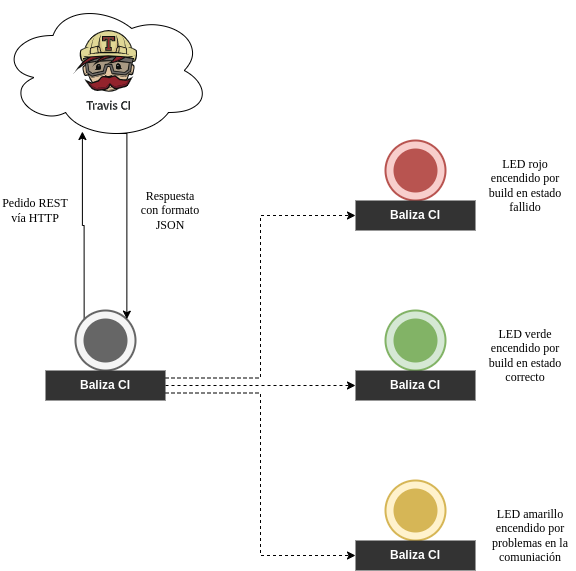
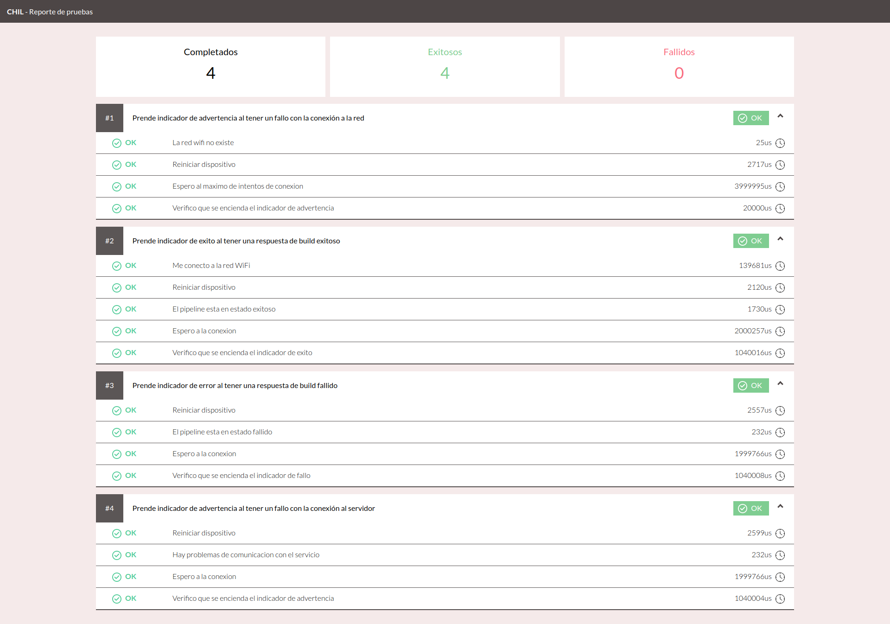
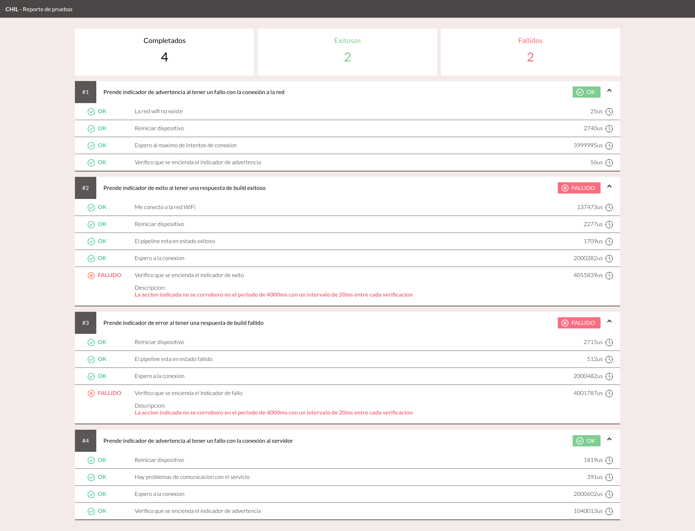

# Paso a paso

Por fines ilustrativos el ejemplo se va a basar utilizando dos ESP32.

### Contexto
La idea es realizar escenarios de prueba para el [proyecto baliza IC](https://github.com/guidorombola/dyasc-baliza-build/tree/wifi-directo).

Como intención de este ejemplo es de mostrar como se hace mock WiFi para probar circuitos que consuman algún servicio web a través de internet complementando el [ejemplo del proyecto de leds](../leds) que muestra como manejar señales cableadas.

El mismo consiste en tener un elemento físico que con unas luces indique el estado del build de integración continua (llamado como "pipeline" a lo largo de este ejemplo):
- Verde = OK
- Rojo = Fallo
- Amarillo = Problemas en la conexión

El objetivo de este producto es poder hacer visible de una manera rápida el estado de build para que el equipo de desarrollo pueda corregir el código en caso de fallo o seguir adelante con otra tarea en caso de que esté bien.



Para ello vamos a necesitar un microcontrolador que pueda conectarse a internet (en este caso via WiFi) y que además tenga conectado los 3 leds correspondientes.

[Diagrama conexión ESP]

### Cableado

El dispositivo a probar tiene las conexiones:
- `Pin G2` emite señal hacia led verde
- `Pin G4` emite señal hacia led rojo
- `Pin G5` emite señal hacia led amarillo

Por ende, el controlador de prueba establece:
- `Pin G2` recibe señal de led verde
- `Pin G4` recibe señal de led rojo
- `Pin G5` recibe señal de led amarillo
- `Pin G19` emite señal de reinicio en el `pin RST` del dispositivo a probar.

### Código de proyecto de LEDs
El código del proyecto se encuentra en [el repositorio baliza IC](https://github.com/guidorombola/dyasc-baliza-build/tree/wifi-directo).
Por cuestiones de simplicidad no se va a optar por poner código de ese proyecto en este tutorial.

### Definición de las pruebas

Los escenarios principales que se tendrán en cuenta serán los siguientes:
1. Comunicación de un build exitoso.
2. Comunicación de un build fallido.
3. Comunicación de problemas en la conexión con la `API` que provee el estado del pipeline.
4. Comunicación de problemas en la conexión `WiFi`.

Explayando los primeros dos escenarios con sus pasos específicos:
1. Prende indicador de éxito al tener una respuesta de build exitoso
    - Me conecto a la red WiFi
    - Reiniciar dispositivo
    - El pipeline esta en estado exitoso
    - Espero a la conexion
    - Verifico que se encienda el indicador de exito


2. Prende indicador de éxito al tener una respuesta de build exitoso
    - Me conecto a la red WiFi
    - Reiniciar dispositivo
    - El pipeline esta en estado fallido
    - Espero a la conexion
    - Verifico que se encienda el indicador de fallo


```c++
    ESCENARIO(Prende indicador de exito al tener una respuesta de build exitoso) {
        PASO(Se crea la red WiFi, conectarseARedWifi);
        PASO(Reiniciar dispositivo, reiniciarSUT);
        PASO(El pipeline esta en estado exitoso, elPipelineEstaEnEstadoExitoso);
        PASO(Espero a la conexion, esperoALaConexion);
        PASO(Verifico que se encienda el indicador de exito, indicadorDeExitoEncendido);
    }

    ESCENARIO(Prende indicador de error al tener una respuesta de build fallido) {
        PASO(Reiniciar dispositivo, reiniciarSUT);
        PASO(El pipeline esta en estado fallido, elPipelineEstaEnEstadoFallido);
        PASO(Espero a la conexion, esperoALaConexion);
        PASO(Verifico que se encienda el indicador de fallo, indicadorDeFalloEncendido);
    }
```

Como detalle específico de estos escenarios es que el contexto del ejecutor de pruebas no se reinicia en cada escenario y es por eso que la creación de la red WiFi está sólo en el primer escenario porque al llegar al siguiente escenario ya se encuentra encendido y no es necesario volver a realizar esa acción

La implementación de los pasos del primer escenario es la siguiente:

```c++
bool conectarseARedWifi() {
    return PLATAFORMA->crearRedWiFi("aceptacion", "clave1234");
}
```
En este paso se utiliza la interfaz `crearRedWifi` provista por la interfaz `Plataforma` de Chil, la cual se utiliza en la `PlataformaESP` que es utilizada para este proyecto.


```c++
void reiniciarSUT() {
    PLATAFORMA->escribir(PIN_DE_REINICIO, 0);
    PLATAFORMA->demorar(2);
    PLATAFORMA->escribir(PIN_DE_REINICIO, 1);
}
```
Para reiniciar el dispositivo simplemente es necesario escribir una señal en el pin de reinicio del dispositivo a probar y eso se encargará de dejarlo con el contexto limpio en un inicio fresco.

```c++
void elPipelineEstaEnEstadoExitoso() {
    PLATAFORMA->crearServidorWeb();
    PLATAFORMA->configurarMockUrls();

    auto* estadoDePipeline = new PuntoDeEntrada(RUTA_ESTADO_PIPELINE);
    estadoDePipeline->configurarRespuesta(RESPUESTA_EXITOSA, "application/json", 200);

    PLATAFORMA->configurarPuntoDeEntrada(estadoDePipeline);
}
```
Este paso es el que configura los mocks de las rutas de la API que consume el dispositivo bajo prueba.
Para ello primero hay que iniciar el servidor web que se encargará de responder en lugar de la `API` real, por lo tanto se utilizará `PLATAFORMA->crearServidorWeb()` provista por la interfaz `Plataforma` e implementada por `PlataformaESP`.

Luego se indicará que se configuren los mocks para las urls de destino con `PLATAFORMA->configurarMockUrls();`. Este paso intercepta cualquier petición via HTTP y la reenvia al servidor que está corriendo en el controlador, pudiendo así no depender del servicio web real.

Una vez realizadas estas configuraciones sólo queda crear que ruta de la url será interceptada y cual será su respuesta.
Para ello se utilizará la clase `PuntoDeEntrada` que sirve como interfaz intermediaria para poder mockear una petición vía HTTP.

El método `configurarRespuesta` recibe el cuerpo de la respuesta, el encoding de la misma y el código de respuesta HTTP.
Una vez creado este punto de entrada simplemente se debe configurar indicando con `PLATAFORMA->configurarPuntoDeEntrada(estadoDePipeline)`.

Luego, si en otros escenarios se necesita que el mismo endpoint devuelva una respuesta diferente, simplemente se debe reemplazar el punto de entrada con la misma ruta y una configuración de respuesta diferente.

Como la definición de la baliza de IC tiene una espera (de 2 segs) entre cada petición al servicio web, se necesita declarar una espera explícita para darle tiempo a que se realice.
```c++
void esperoALaConexion() {
    PLATAFORMA->demorar(2000);
}
```

Por el delay entre las peticiones cuando se realice la verificación de LED encendido, se necesitará realizar la misma en forma de sondeo (polling) porque puede pasar en un intervalo dado.
```c++
bool queElIndicadorDeExitoEncendido() {
    return PLATAFORMA->leer(PIN_LED_EXITO) == ESTA_ENCENDIDO;
}

void indicadorDeExitoEncendido() {
    comprobar(queElIndicadorDeExitoEncendido)
                        ->durante(TIEMPO_LIMITE_VERIFICAR_INDICADOR_MS)
                        ->conIntervaloDe(TIEMPO_ENTRE_VERIFICACIONES_INDICADOR)
                        ->seHayaEjecutado();
}
```
Se utilizará la herramienta provista por la librería `Verificacion` para configurar el sondeo.
En este caso concreto se ejecutara el método `queElIndicadorDeExitoEncendido()` durante `2000ms` con un intervalo de `20ms` entre cada verificación.

La vista general de las pruebas es la siguiente (tomada del archivo `main.cpp`):
```c++
#include <PlataformaESP.h>
#include <Chil.h>
#include <pasos.h>

PRUEBAS
NUEVO_CHIL_CON(PLATAFORMA_ESP);
PLATAFORMA->demorar(2000);
configurarIO();

    ESCENARIO(Prende indicador de advertencia al tener un fallo con la conexión a la red) {
        PASO(La red wifi no existe, laRedWifiNoExiste);
        PASO(Reiniciar dispositivo, reiniciarSUT);
        PASO(Espero al maximo de intentos de conexion, esperoElMaximoDeIntentosDeConexion);
        PASO(Verifico que se encienda el indicador de advertencia, indicadorDeDesconexionEncendido);
    }

    ESCENARIO(Prende indicador de exito al tener una respuesta de build exitoso) {
        PASO(Me conecto a la red WiFi, conectarseARedWifi);
        PASO(Reiniciar dispositivo, reiniciarSUT);
        PASO(El pipeline esta en estado exitoso, elPipelineEstaEnEstadoExitoso);
        PASO(Espero a la conexion, esperoALaConexion);
        PASO(Verifico que se encienda el indicador de exito, indicadorDeExitoEncendido);
    }

    ESCENARIO(Prende indicador de error al tener una respuesta de build fallido) {
        PASO(Reiniciar dispositivo, reiniciarSUT);
        PASO(El pipeline esta en estado fallido, elPipelineEstaEnEstadoFallido);
        PASO(Espero a la conexion, esperoALaConexion);
        PASO(Verifico que se encienda el indicador de fallo, indicadorDeFalloEncendido);
    }

    ESCENARIO(Prende indicador de advertencia al tener un fallo con la conexión al servidor) {
        PASO(Reiniciar dispositivo, reiniciarSUT);
        PASO(Hay problemas de comunicacion con el servicio, hayProblemasDeComunicacionConElServicio);
        PASO(Espero a la conexion, esperoALaConexion);
        PASO(Verifico que se encienda el indicador de advertencia, indicadorDeDesconexionEncendido);
    }

FIN_DE_PRUEBAS;
FIN
```

### Ejecución

#### Herramientas
Para compilar y subir el código al dispositivo ejecutor de pruebas se utilizará la herramienta de [PlatformIO](https://platformio.org/) por lo que es necesario tener instalada la [CLI (herramienta de línea de comando)](https://docs.platformio.org/en/latest/core/index.html) como lo explica su documentación.

Para ayudar la ejecución y poder visualizar mejor el reporte de las pruebas se recomienda utilizar la [herramienta CLI de Chil](../../herramientas/README.md) como se hace en este ejemplo.

#### Configuracion previa

Dando por sentado que los dispositivos están interconectados como lo indica la sección de [Conexión](#cableado), el dispositivo con el código de los leds ya cargado y el dispositivo ejecutor de pruebas conectado a un USB del equipo.

El archivo `platformio.ini` contiene la descripción sobre la plataforma y placa a utilizar
```ini
[env:esp32dev]
platform = espressif32
board = esp32dev
framework = arduino
monitor_speed = 115200
lib_deps =
    joacomf/Chil
    joacomf/Chil-plataforma-ESP
```

Como dependencias están declaradas las librerías de [Chil](https://registry.platformio.org/libraries/joacomf/Chil) y [Chil-plataforma-ESP](https://registry.platformio.org/libraries/joacomf/Chil-plataforma-ESP) que se usaron en el código del ejemplo [descrito anteriormente](#código-del-proyecto-de-leds)

El comando de platformio para desplegar el código y seguir el monitorear la ejecución con la configuración definida en `platformio.ini` es:
```shell
platformio run --target upload --target monitor --environment esp32dev
```

Luego de instalar la herramienta e inicializar Chil, configuraremos el comando en el archivo `.chil` de la siguiente manera
```
[comando]
platformio run --target upload --target monitor --environment esp32dev
```

Ya estamos listos para ejecutar las pruebas
```shell
chil correr
```

Y ver el reporte de las pruebas en una web como el siguiente:



Para demostrar la sensibilidad de estas pruebas y ver como se ve cuando falla, se pueden desconectar, por ejemplo, los cables de los pines G2 y G4 del controlador de pruebas y el resultado se verá de la siguiente manera:



