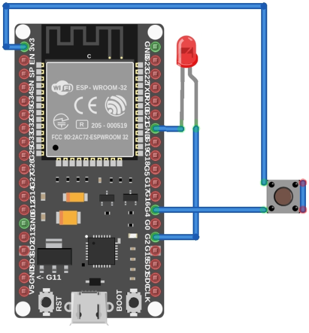
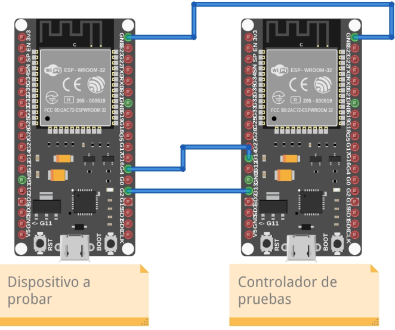

# Paso a paso

Por fines ilustrativos el ejemplo se va a basar utilizando dos ESP32.

### Contexto
Supongamos que queremos desarrollar las pruebas de comportamiento de un microcontrolador que, a partir de un switch/botón, se prende y apaga una luz de LED.



Lo primero que necesitamos es realizar la conexión cableada del dispositivo a probar (SUT) con el controlador de pruebas. Donde el controlador de pruebas será quien reciba el otro extremo de los terminales del botón y del led respectivamente para poder generar estímulos (presionar el botón) y verificar respuesta (que el led encienda)




### Cableado
En este caso concreto el dispositivo a probar tiene las conexiones:
- Pin G2 emisor de señal para encender el led
- Pin G4 receptor para recibir el presionar del botón

Por ende, el controlador de prueba establece:
- Pin G14 como receptor para la señal de encendido del led (emitido por G2 del otro dispositivo)
- Pin G13 como emisor para la señal del botón (recibida por G4 del otro dispositivo)

### Código del proyecto de leds
El código de este ejemplo es trivial para que sean pocos escenarios pero concretos a la hora de definir.

```c++
#define LED 2
#define BUTTON 4

void setup() {
    Serial.begin(115200);

    pinMode(LED, OUTPUT);
    pinMode(BUTTON, INPUT);
}

void loop() {
    if (digitalRead(BUTTON) == HIGH) {
        digitalWrite(LED, HIGH);
    } else {
        digitalWrite(LED, LOW);
    }

    delay(20);
}
```
Primero se configuran los pines de entrada y salida de `LED` y `BOTON`

Luego en el método `loop()` se lee el estado del botón y si está presionado se manda señal de encendido, caso contrario se apaga, con un delay de 20 ms entre cada iteración.

### Definición de las pruebas
Entonces, a partir de esta configuración podemos considerar 2 pruebas simples:
1. Al presionar por primera vez el botón enciende el led
2. Al soltar luego de estar presionado se apaga el led

Explayando los pasos de estos escenarios tendríamos
1. Al presionar por primera vez el botón enciende el led
    - Cuando presiono el botón
    - Espero que encienda
    - Verifico que el led se enciende
    - Suelto el botón

2. Al soltar luego de estar presionado se apaga el led
   - Dado que presiono el botón
   - Espero que encienda
   - Cuando suelto el botón
   - Espero que apague
   - Verifico que el led se apaga

Utilizando Chil, estos escenarios se verían de la siguiente manera:
```c++
    ESCENARIO(Al presionar por primera vez el boton enciende el led){
        PASO(Cuando presiono el boton, presionoElBoton);
        PASO(Y espero que encienda, espero25Milis);
        PASO(Verifico que el led se enciende, elLedEstaEncendido);
        PASO(Suelto el boton, sueltoElBoton);
    };

    ESCENARIO(Al soltar luego de estar presionado se apaga el led){
        PASO(Dado que presiono el boton, presionoElBoton);
        PASO(Y espero que encienda, espero25Milis);
        PASO(Cuando suelto el boton, sueltoElBoton);
        PASO(Y espero que apague, espero25Milis);
        PASO(Verifico que el led se apaga, elLedEstaApagado);
    };
```
Siendo el primer parámetro del `PASO` la descripción del mismo y el segundo es la referencia al método que se encarga de hacer la acción con el dispositivo. Por ende esos métodos deberían estar definidos, como por ejemplo:

```c++
#define LED_AZUL 2
#define BOTON_ROJO 4

void presionoElBoton() {
    PLATAFORMA->escribir(BOTON_ROJO, 1);
}

void sueltoElBoton() {
    PLATAFORMA->escribir(BOTON_ROJO, 0);
}

void elLedEstaEncendido() {
    verificar(PLATAFORMA->leer(LED_AZUL))->esIgualA(1);
}

void elLedEstaApagado() {
    verificar(PLATAFORMA->leer(LED_AZUL))->esIgualA(0);
}

void espero25Milis() {
    PLATAFORMA->demorar(25);
}
```
Las definiciones de `LED_AZUL` y `BOTON_ROJO` son los números de pines a los cuales estarían conectados dichos componentes (como se explica en sección [Cableado](#cableado)).

En este ejemplo se utiliza `PLATAFORMA` que es la referencia hacia la instancia de `Chil` donde se pueden usar todas los métodos disponibles.

Además, se utiliza la librería de `Verificacion` donde se puede utilizar los métodos estáticos de `verificar()` y sus comparaciones (una versión muy pequeña, inspirada en [AssertJ](http://joel-costigliola.github.io/assertj/))

Para terminar de ensamblar este ejemplo se necesita crear el contexto de *Chil* y configurar el IO (las entradas y salidas)

La entrada y salida se puede definir en un método, como el siguiente:
```c++
void configurarIO() {
    PLATAFORMA->pinSalida(BOTON_ROJO);
    PLATAFORMA->pinEntrada(LED_AZUL);
}
```

Y por último el contexto de *Chil* se puede definir utilizando las macros:
- `NUEVO_CHIL_CON` define una nueva instancia de *Chil* recibiendo que sobre tipo de plataforma correrá (para que pueda utilizar la implementación correspondiente)
- `PLATAFORMA_ESP` es una nueva instancia de `PlataformaESP`
- `FIN_DE_PRUEBAS` genera el reporte final junto con un JSON exportable

```c++
NUEVO_CHIL_CON(PLATAFORMA_ESP);
    configurarIO();
    
    // Acá irían los escenarios definidos previamente
FIN_DE_PRUEBAS;
```

Por cuestiones de practicidad, se extrajeron los métodos de los pasos al archivo `pasos.cpp` para que en `main.cpp` solo queden definidas las pruebas. Esto se puede ver en la carpeta [src](pruebas/src) del proyecto

### Ejecución

#### Herramientas
Para compilar y subir el código al dispositivo ejecutor de pruebas se utilizará la herramienta de [PlatformIO](https://platformio.org/) por lo que es necesario tener instalada la [CLI (herramienta de línea de comando)](https://docs.platformio.org/en/latest/core/index.html) como lo explica su documentación.

Para ayudar la ejecución y poder visualizar mejor el reporte de las pruebas se recomienda utilizar la [herramienta CLI de Chil](../../herramientas/README.md) como se hace en este ejemplo.

#### Configuracion previa

Dando por sentado que los dispositivos están interconectados como lo indica la sección de [Conexión](#cableado), el dispositivo con el código de los leds ya cargado y el dispositivo ejecutor de pruebas conectado a un USB del equipo.

El archivo `platformio.ini` contiene la descripción sobre la plataforma y placa a utilizar
```ini
[env:esp32dev]
platform = espressif32
board = esp32dev
framework = arduino
monitor_speed = 115200
lib_deps =
    joacomf/Chil
    joacomf/Chil-plataforma-ESP
```

Como dependencias están declaradas las librerías de [Chil](https://registry.platformio.org/libraries/joacomf/Chil) y [Chil-plataforma-ESP](https://registry.platformio.org/libraries/joacomf/Chil-plataforma-ESP) que se usaron en el código del ejemplo [descrito anteriormente](#código-del-proyecto-de-leds)

El comando de platformio para desplegar el código y seguir el monitorear la ejecución con la configuración definida en `platformio.ini` es:
```shell
platformio run --target upload --target monitor --environment esp32dev
```

Luego de instalar la herramienta e inicializar Chil, configuraremos el comando en el archivo `.chil` de la siguiente manera
```
[comando]
platformio run --target upload --target monitor --environment esp32dev
```

Ya estamos listos para ejecutar las pruebas
```shell
chil correr
```

Y ver el reporte de las pruebas en una web como el siguiente:


